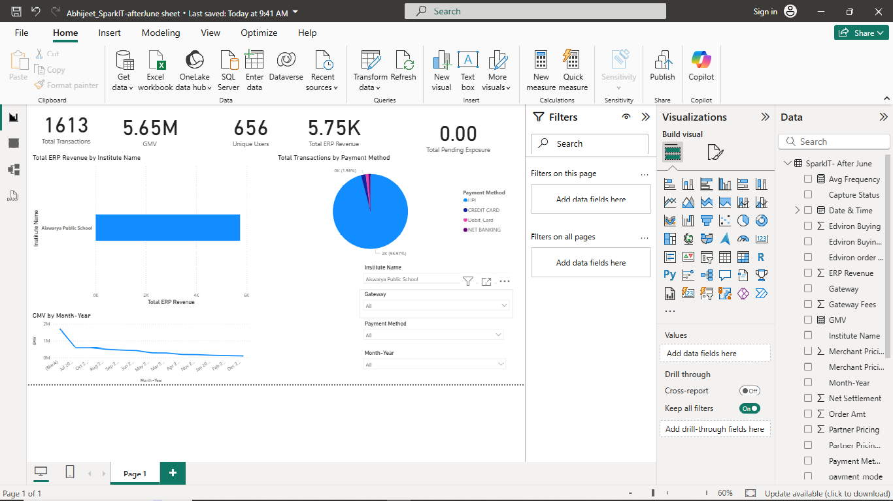

# Edviron-Revenue-Dashboard-ATSparkIT-Afterjune
Revenue, Commission &amp; Settlement Analytics Dashboard

# Edviron Revenue Analytics Dashboard

## 📊 Project Overview
This Power BI dashboard analyzes revenue, commission, and settlement metrics for Edviron's payment processing business.

## 🔑 Key Features
- Revenue analysis (ERP Revenue, Edviron Net Revenue)
- Gateway-wise and payment method analysis
- Pending exposure tracking
- Customer metrics (unique users, frequency)

## 📁 Files Included
- `Edviron_Dashboard.pbix` - Main Power BI dashboard file
- `Explanation_Note.docx` - Detailed logic and assumptions

## 🛠️ Tools Used
- Power BI Desktop
- DAX for measures
- Power Query for data cleaning

- ## 📊 Dashboard Preview

